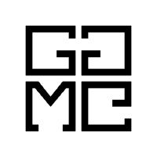

# Gametask

<h3 align="center">
   
</h3>

## :rocket: Technology

This project was developed with the following technologies:

- [React JS](https://reactjs.org)
- [Styled Components](https://styled-components.com/)
- [Styled Media Query](https://github.com/morajabi/styled-media-query)
- [React Redux](https://react-redux.js.org/)

## 💻 Project

In view of the project's purpose (managing classes and school / academic activities) the main responsibilities and non-responsibilities of the system are shown below.

### User Test

    email: suporte@gametask.com.br
    senha: testXXXX

## Links

- [API Docs - Endpoints](#)
- [Figma](#)

---

<h4 align="center">
  Code made :heart: by <a href="https://gametask.com.br" target="_blank">Gametask</a>
</h4>
